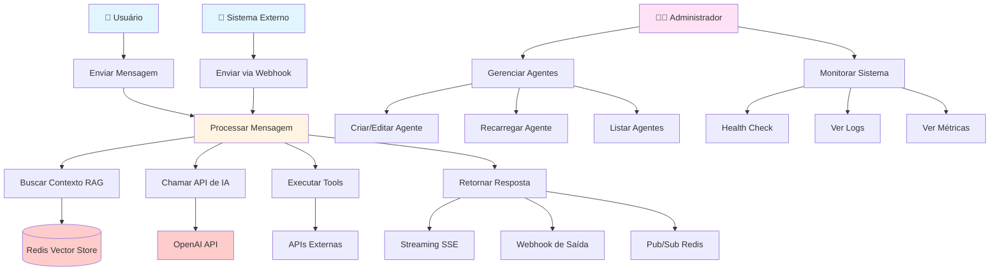
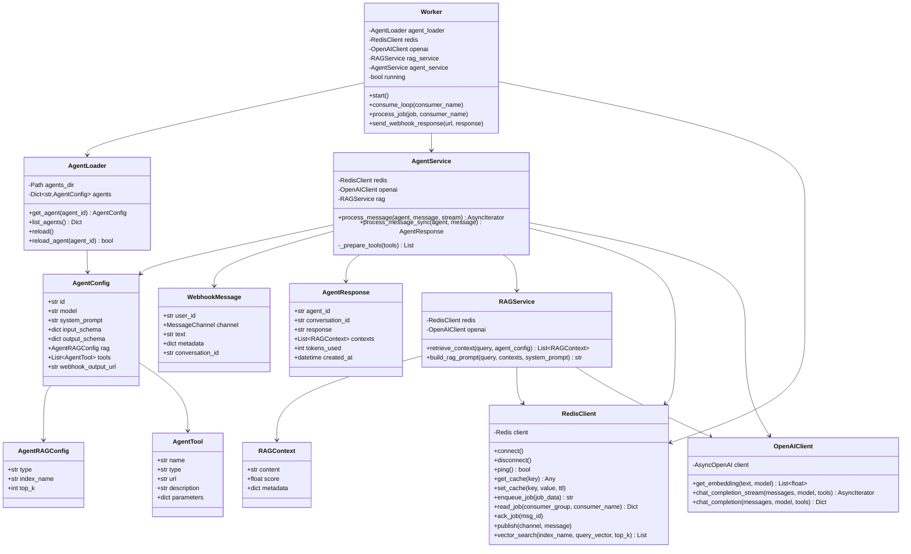
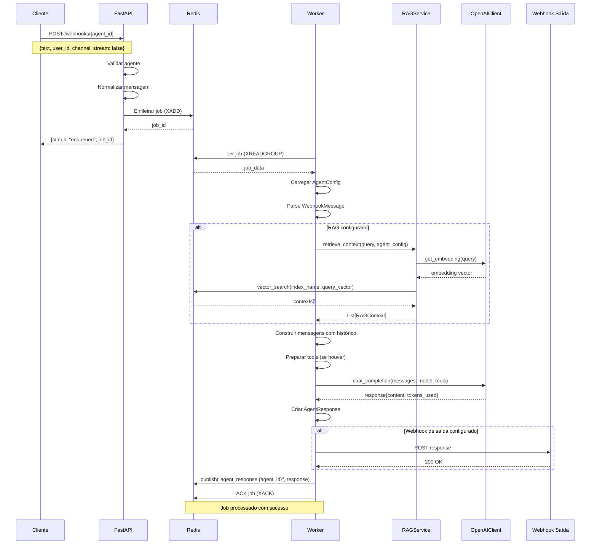
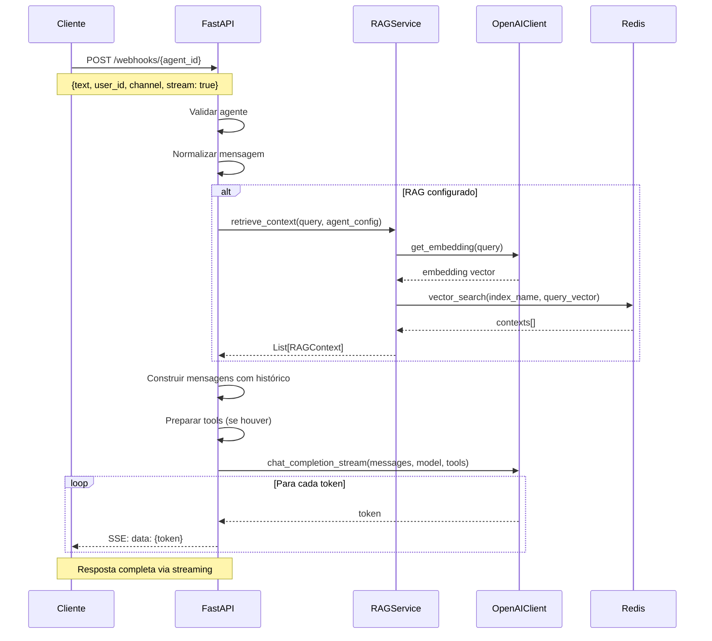
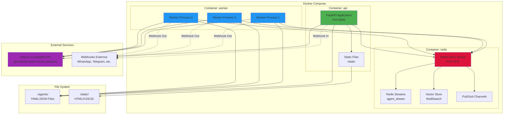
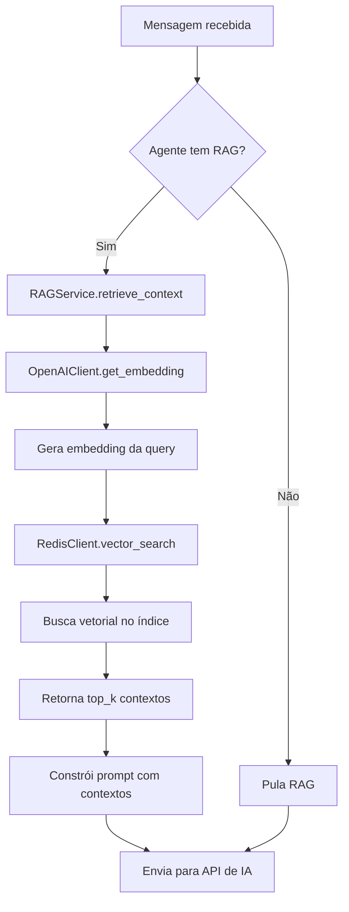
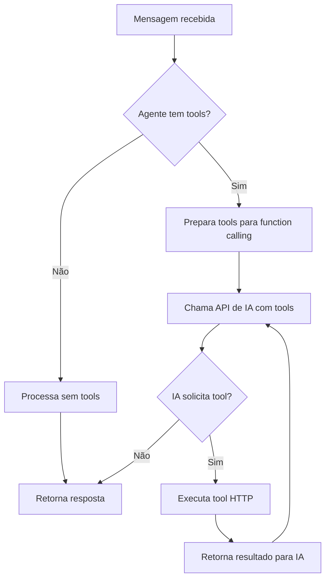

# Documentação do Projeto - AI Agent API

## 📋 Índice

1. [Visão Geral](#visão-geral)
2. [Arquitetura do Sistema](#arquitetura-do-sistema)
3. [Diagramas](#diagramas)
   - [Casos de Uso](#diagrama-de-casos-de-uso)
   - [Classes](#diagrama-de-classes)
   - [Sequência - Processamento de Mensagem](#diagrama-de-sequência)
   - [Componentes](#diagrama-de-componentes)
   - [Deploy](#diagrama-de-deploy)
4. [Estrutura do Projeto](#estrutura-do-projeto)
5. [Fluxos Principais](#fluxos-principais)
6. [Tecnologias Utilizadas](#tecnologias-utilizadas)

---

## Visão Geral

O **AI Agent API** é um sistema de agentes de IA conversacionais com suporte a RAG (Retrieval Augmented Generation), processamento assíncrono e webhooks. O sistema permite criar e gerenciar múltiplos agentes configuráveis via arquivos YAML/JSON, cada um com suas próprias características, modelos de IA, contextos RAG e ferramentas.

### Principais Características

- 🤖 **Agentes Configuráveis**: Cada agente é definido via arquivo YAML/JSON
- 🔍 **RAG (Retrieval Augmented Generation)**: Busca vetorial para enriquecer respostas com contexto
- ⚡ **Processamento Assíncrono**: Workers em background para processar mensagens
- 🔄 **Streaming**: Suporte a Server-Sent Events (SSE) para respostas em tempo real
- 🔌 **Webhooks**: Entrada e saída via webhooks para integração com sistemas externos
- 🛠️ **Tools/Functions**: Suporte a function calling para integração com APIs externas
- 📊 **Multi-canal**: Suporte a WhatsApp, Telegram, Slack e Web

---

## Arquitetura do Sistema

O sistema segue uma arquitetura em camadas com separação de responsabilidades:

```
┌─────────────────────────────────────────────────────────────┐
│                      Camada de Apresentação                  │
│  ┌──────────────┐  ┌──────────────┐  ┌──────────────┐      │
│  │   Web UI     │  │  REST API    │  │   Webhooks   │      │
│  │  (Static)    │  │  (FastAPI)   │  │   (HTTP)     │      │
│  └──────────────┘  └──────────────┘  └──────────────┘      │
└─────────────────────────────────────────────────────────────┘
                            │
┌─────────────────────────────────────────────────────────────┐
│                      Camada de Domínio                       │
│  ┌──────────────┐  ┌──────────────┐  ┌──────────────┐      │
│  │ AgentService │  │  RAGService  │  │ AgentLoader  │      │
│  └──────────────┘  └──────────────┘  └──────────────┘      │
└─────────────────────────────────────────────────────────────┘
                            │
┌─────────────────────────────────────────────────────────────┐
│                   Camada de Infraestrutura                   │
│  ┌──────────────┐  ┌──────────────┐  ┌──────────────┐      │
│  │ RedisClient  │  │OpenAIClient  │  │   Worker     │      │
│  └──────────────┘  └──────────────┘  └──────────────┘      │
└─────────────────────────────────────────────────────────────┘
                            │
┌─────────────────────────────────────────────────────────────┐
│                    Serviços Externos                         │
│  ┌──────────────┐  ┌──────────────┐                        │
│  │     Redis    │  │  OpenAI API  │                        │
│  │   (Stack)    │  │  (Compatible)│                        │
│  └──────────────┘  └──────────────┘                        │
└─────────────────────────────────────────────────────────────┘
```

---

## Diagramas

### Diagrama de Casos de Uso



### Diagrama de Classes



### Diagrama de Sequência

#### Processamento de Mensagem (Modo Assíncrono)



#### Processamento de Mensagem (Modo Streaming)



### Diagrama de Componentes

```mermaid
graph TB
    subgraph "Camada de Apresentação"
        WebUI[Web UI<br/>Static Files]
        FastAPI[FastAPI Application<br/>REST API]
        WebhookEndpoint[Webhook Endpoints<br/>/webhooks/{agent_id}]
    end
    
    subgraph "Camada de Domínio"
        AgentService[AgentService<br/>Orquestração]
        RAGService[RAGService<br/>Retrieval Augmented Generation]
        AgentLoader[AgentLoader<br/>Carregamento de Agentes]
    end
    
    subgraph "Camada de Infraestrutura"
        RedisClient[RedisClient<br/>Cache, Queue, Pub/Sub, Vector]
        OpenAIClient[OpenAIClient<br/>Embeddings & Chat]
        Worker[Worker<br/>Processamento Assíncrono]
    end
    
    subgraph "Armazenamento"
        Redis[(Redis Stack<br/>Cache, Streams, Vector Store)]
        AgentsFS[Agents Directory<br/>YAML/JSON Files]
    end
    
    subgraph "Serviços Externos"
        OpenAIAPI[OpenAI Compatible API<br/>Qwen/Qwen2.5-3B-Instruct]
        ExternalAPIs[APIs Externas<br/>Tools/Functions]
        WebhookOut[Webhooks de Saída<br/>Sistemas Externos]
    end
    
    WebUI --> FastAPI
    FastAPI --> WebhookEndpoint
    WebhookEndpoint --> AgentService
    WebhookEndpoint --> RedisClient
    
    AgentService --> RAGService
    AgentService --> OpenAIClient
    AgentService --> AgentLoader
    AgentService --> RedisClient
    
    RAGService --> RedisClient
    RAGService --> OpenAIClient
    
    AgentLoader --> AgentsFS
    
    RedisClient --> Redis
    OpenAIClient --> OpenAIAPI
    
    Worker --> AgentService
    Worker --> RedisClient
    Worker --> WebhookOut
    
    AgentService -.->|Tools| ExternalAPIs
    
    style FastAPI fill:#4CAF50
    style AgentService fill:#2196F3
    style RAGService fill:#FF9800
    style Redis fill:#DC143C
    style OpenAIAPI fill:#9C27B0
```

### Diagrama de Deploy



---

## Estrutura do Projeto

```
ai-test/
├── app/                          # Código da aplicação
│   ├── __init__.py
│   ├── main.py                   # FastAPI application e endpoints
│   ├── worker.py                 # Worker assíncrono para processar jobs
│   ├── config.py                 # Configurações (Settings)
│   ├── models.py                 # Modelos Pydantic
│   ├── agent_loader.py           # Carregador de agentes YAML/JSON
│   │
│   ├── domain/                   # Camada de domínio (lógica de negócio)
│   │   ├── __init__.py
│   │   ├── agent_service.py      # Serviço de orquestração de agentes
│   │   └── rag_service.py         # Serviço de RAG
│   │
│   └── infrastructure/           # Camada de infraestrutura
│       ├── __init__.py
│       ├── redis_client.py        # Cliente Redis (cache, queue, pub/sub, vector)
│       └── openai_client.py       # Cliente OpenAI (embeddings, chat)
│
├── agents/                       # Configurações de agentes
│   ├── chatbot_simples.yaml      # Agente simples de exemplo
│   ├── faq_educacao.yaml         # Agente especializado em educação
│   └── README.md
│
├── static/                       # Arquivos estáticos (UI web)
│   ├── index.html
│   ├── script.js
│   └── styles.css
│
├── docker-compose.yml            # Orquestração de containers
├── Dockerfile                    # Imagem Docker da aplicação
├── requirements.txt              # Dependências Python
├── env.example                   # Exemplo de variáveis de ambiente
├── README.md                     # Documentação básica
└── DOCUMENTACAO.md               # Esta documentação
```

---

## Fluxos Principais

### 1. Fluxo de Criação e Carregamento de Agente

```mermaid
flowchart TD
    A[Administrador cria arquivo YAML] --> B[Arquivo salvo em agents/]
    B --> C{API iniciada?}
    C -->|Não| D[AgentLoader carrega na inicialização]
    C -->|Sim| E[POST /agents/reload]
    E --> D
    D --> F[AgentLoader lê arquivo YAML]
    F --> G[Valida e cria AgentConfig]
    G --> H[Armazena em memória]
    H --> I[Agente disponível em /webhooks/{agent_id}]
```

### 2. Fluxo de Processamento RAG



### 3. Fluxo de Processamento com Tools



---

## Tecnologias Utilizadas

### Backend

- **Python 3.11+**: Linguagem principal
- **FastAPI**: Framework web assíncrono para API REST
- **Uvicorn**: Servidor ASGI de alta performance
- **Pydantic**: Validação de dados e modelos
- **Redis (asyncio)**: Cliente assíncrono para Redis
- **OpenAI SDK**: Cliente para APIs compatíveis com OpenAI
- **PyYAML**: Parser para arquivos YAML
- **httpx**: Cliente HTTP assíncrono

### Infraestrutura

- **Docker & Docker Compose**: Containerização e orquestração
- **Redis Stack**: Cache, filas (Streams), busca vetorial (RediSearch)
- **Nginx** (opcional): Reverse proxy e load balancing

### APIs e Serviços

- **OpenAI Compatible API**: API proprietária compatível com OpenAI
  - Modelo: `Qwen/Qwen2.5-3B-Instruct`
  - Base URL: `https://api.sobdemanda.mandu.piaui.pro/v1`
  - Suporta: embeddings, chat completions, streaming

### Padrões e Arquitetura

- **Arquitetura em Camadas**: Separação entre apresentação, domínio e infraestrutura
- **Clean Architecture**: Princípios SOLID e separação de responsabilidades
- **Async/Await**: Programação assíncrona para alta concorrência
- **Event-Driven**: Pub/Sub para comunicação entre componentes
- **Queue-Based**: Processamento assíncrono via Redis Streams

---

## Configuração de Agentes

### Estrutura de um Agente YAML

```yaml
id: identificador_unico
model: Qwen/Qwen2.5-3B-Instruct
system_prompt: |
  Instruções do sistema para o agente

input_schema:
  type: object
  properties:
    question:
      type: string
      description: Pergunta do usuário

output_schema:
  type: object
  properties:
    answer:
      type: string
      description: Resposta do agente

rag:
  type: redis
  index_name: nome_do_indice
  top_k: 5

tools:
  - name: nome_da_ferramenta
    type: http
    url: https://api.exemplo.com/endpoint
    description: Descrição da ferramenta
    parameters:
      type: object
      properties:
        parametro1:
          type: string
      required:
        - parametro1

webhook_output_url: https://webhook.exemplo.com/callback
```

### Campos do Agente

- **id**: Identificador único do agente (obrigatório)
- **model**: Modelo de IA a ser usado (padrão: Qwen/Qwen2.5-3B-Instruct)
- **system_prompt**: Instruções do sistema para o agente
- **input_schema**: Schema JSON Schema para validação de entrada
- **output_schema**: Schema JSON Schema para validação de saída
- **rag**: Configuração de RAG (opcional)
  - **type**: Tipo de RAG (atualmente apenas "redis")
  - **index_name**: Nome do índice vetorial no Redis
  - **top_k**: Número de contextos a recuperar
- **tools**: Lista de ferramentas disponíveis (opcional)
- **webhook_output_url**: URL para enviar respostas (opcional)

---

## Endpoints da API

### Health Check
```
GET /health
```
Retorna status do sistema e conexões.

### Listar Agentes
```
GET /agents
```
Lista todos os agentes configurados.

### Obter Agente
```
GET /agents/{agent_id}
```
Retorna configuração completa de um agente.

### Recarregar Agentes
```
POST /agents/reload
POST /agents/{agent_id}/reload
```
Recarrega todos os agentes ou um agente específico.

### Webhook de Entrada
```
POST /webhooks/{agent_id}
Content-Type: application/json

{
  "user_id": "user123",
  "channel": "whatsapp",
  "text": "Mensagem do usuário",
  "conversation_id": "conv123",
  "history": [
    {"role": "user", "content": "Mensagem anterior"},
    {"role": "assistant", "content": "Resposta anterior"}
  ],
  "stream": false,
  "metadata": {}
}
```

**Parâmetros:**
- `user_id`: Identificador do usuário (obrigatório)
- `channel`: Canal de comunicação (whatsapp, telegram, slack, web)
- `text`: Texto da mensagem (obrigatório)
- `conversation_id`: ID da conversa (opcional, gerado automaticamente se não fornecido)
- `history`: Histórico de mensagens anteriores (opcional)
- `stream`: Se `true`, retorna resposta via SSE (opcional, padrão: false)
- `metadata`: Metadados adicionais (opcional)

**Resposta (stream: false):**
```json
{
  "status": "enqueued",
  "job_id": "uuid-do-job",
  "agent_id": "identificador"
}
```

**Resposta (stream: true):**
Server-Sent Events (SSE) com tokens da resposta em tempo real.

---

## Processamento Assíncrono

O sistema utiliza **Redis Streams** para processamento assíncrono de mensagens:

1. **Enfileiramento**: API enfileira job no Redis Stream
2. **Consumo**: Workers consomem jobs usando Consumer Groups
3. **Processamento**: Worker processa mensagem com agente
4. **Resposta**: Worker envia resposta via webhook ou pub/sub
5. **ACK**: Worker confirma processamento (XACK)

### Vantagens

- **Escalabilidade**: Múltiplos workers podem processar em paralelo
- **Resiliência**: Jobs não são perdidos se worker falhar
- **Performance**: API responde rapidamente sem bloquear
- **Balanceamento**: Redis distribui jobs entre workers

---

## RAG (Retrieval Augmented Generation)

O sistema implementa RAG para enriquecer respostas com contexto relevante:

1. **Embedding**: Gera embedding vetorial da query do usuário
2. **Busca Vetorial**: Busca documentos similares no Redis Vector Store
3. **Contexto**: Monta prompt com contextos encontrados
4. **Geração**: IA gera resposta baseada no contexto

### Configuração

1. Configure `rag` no YAML do agente
2. Popule o índice vetorial no Redis (processo externo)
3. O sistema automaticamente usa RAG quando configurado

---

## Monitoramento e Observabilidade

### Logs

O sistema gera logs estruturados com:
- Timestamp
- Nível (INFO, WARNING, ERROR)
- Componente
- Mensagem
- Contexto (agent_id, conversation_id, etc.)

### Health Check

Endpoint `/health` retorna:
- Status geral do sistema
- Status da conexão Redis
- Número de agentes carregados

### Pub/Sub

Respostas são publicadas no canal Redis:
```
agent_response:{agent_id}
```

Permite monitoramento em tempo real de respostas.

---

## Desenvolvimento

### Adicionar Novo Agente

1. Crie arquivo YAML em `agents/`
2. Execute `POST /agents/reload` ou reinicie a API
3. Agente estará disponível em `/webhooks/{agent_id}`

### Modificar Código

O código está organizado em camadas:
- **Infrastructure**: Clientes externos (Redis, OpenAI)
- **Domain**: Lógica de negócio (RAG, agentes)
- **API**: Endpoints HTTP (FastAPI)
- **Worker**: Processamento assíncrono

### Testes

```bash
# Teste local
python -m pytest

# Teste com Docker
docker-compose up --build
```

---

## Próximos Passos

- [ ] Implementação completa de busca vetorial no Redis
- [ ] Sistema de retry para jobs falhos
- [ ] Métricas e monitoramento (Prometheus/Grafana)
- [ ] Autenticação de webhooks
- [ ] Suporte a múltiplos canais (WhatsApp, Telegram, etc.)
- [ ] UI para gerenciar agentes
- [ ] Testes automatizados
- [ ] Documentação OpenAPI/Swagger
- [ ] Rate limiting
- [ ] Cache de respostas

---

## Licença

MIT

---

**Documentação gerada em:** 2024  
**Versão do Sistema:** 1.0.0

